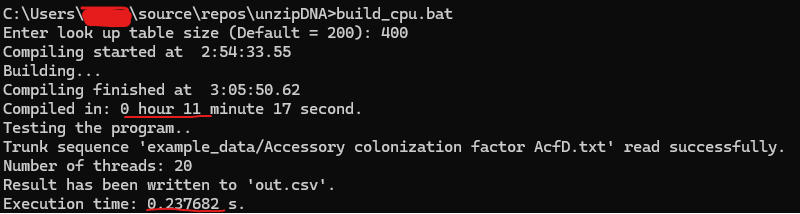
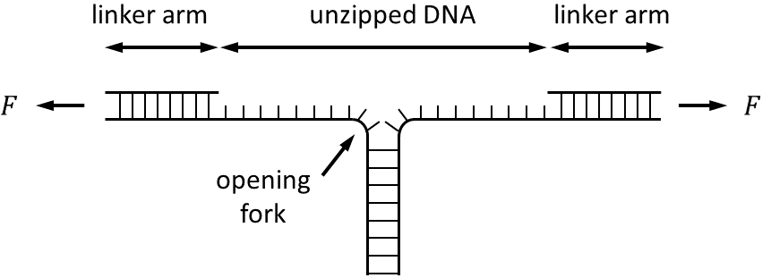

# DNA Unzipping Curve Calculator   
  
## PART I. CPU version -- 1000x faster than the proof-of-concept program  

*At the current stage after my optimization, this program is 1,000-2,000 times faster than my proof-of-concept Python code.*  

### Goal of this program  

My goal is to make the unzipping curve calculation fast (so I can calculate the unzipping curves of thousands of genes in an acceptable time). However, there is no better method other than brute-force partition function calculation for now. The only thing I can do is to make each loop faster. I decided to calculate something ahead of time and save it in the program as constexpr variables.

It took some thinking to move a majority of the calculation from run-time to compile time. After several attempts, I **"constexpred"** most of the calculation overhead. Two look-up tables (LUTs) are created to hold these data. These LUTs are saved in **constexpr std::arrays** so I have to use c++20 (or above). The drawback is that the compile time is very long, thousands of times longer than a straightforward C++ program.  
  
On Aug/15/2023, I implemented multithreading. The execution speed increased by another factor of 10.  
  
### How to build the project  

The build command should work on Windows and Linux:  

```bash
>g++ -std=c++20 -fconstexpr-ops-limit=100000000000 main.cpp utils.cpp -DJ_SIZE=200 -DEXT_SIZE=200 -o main.exe
```
The lookup table size is controlled by macro **J_SIZE**. The larger the number, the more accurate the result. Increasing this number can significantly increase the compiling time.  
  
For Windows OS, run **build_cpu.bat** to build with *additional options and testing*. For Linux users, ChatGPT should be able to translate the .bat file to a shell script. If the .bat file is ran successfully, you should see something like this:  
  
  
  
The compile time is quite long if the look-up table size is big!  

### Do some tests using the example data  

Some example sequences are provided (e.g. Accessory colonization factor AcfD). You can run the executable on this example like this:  

```bash
>main_cpu.exe "NEB_H5alpha_Accessory colonization factor AcfD.txt" out.csv
```

The first argument is the input file name. The second argument determines the output file name and is optional.  

## PART II. GPU version -- 10x faster than the CPU version  

Combined CUDA with the look-up table optimization (see the next section), it runs pretty fast and can finish the whole *E.coli*  genome in about a minute on my GeForce RTX 3070 Laptop.  

### Why CUDA  

Single-molecule approaches such as optical tweezers, can unzip a single dsDNA at a single-molecule level.

  

The theoretical prediction of an unzipping trace (*unzipping force vs total extension*) can be obtained from a partition function of the system. The partition function $Z$ at a total extension of the system $z$ is

$$Z(z) = \sum_{j=0}^{j_{max}}e^{-G(j,z)/kT}$$

where $G(j,z)$ is the total energy of the system. Force $F(z)$ can be obtained from a partition function as follows:  

$$F(z) = -kT\frac{\partial }{\partial z}\mathrm{ln}Z$$

To calculate the force-extension curve, we need to obtain the energy $G(j,z)$ at every j and z. However, the calculation of $G$ is time-consuming, and the scales of $j$ and $z$ are large (usually in a range of 1,000-10,000). Moreover, we need to calculate the unzipping traces for every gene in the genome. Even *E. Coli* has thousands of genes, so this is a perfect task for GPU.  

### Instructions to Use (with Example Data)  

1. The example genome is NEB H5alpha, the genbank file is in "other_data" folder.  
2. Run **parse_h5alpha.py** to parse the *200304_NEB_H5alpha_genbank.txt* and *200304_NEB_H5alpha.txt* to individual files.  
3. Build the project on Windows. This .bat file will automatically run a test using the sequences in "example_data" folder  

```bash
> build_gpu.bat
```
To batch-process sequence files in your own folder, use this command  

```bash
> main_gpu path/to/your/own/folder
```

Results of the first 23 genes:  


Prediction vs Experiment:  
  

  
**DNA unzipping experiment vs theory**. The prediction (**${\color{black}-}$**) aligns well with the single-molecule unzipping curve (**${\color{red}-}$**).  
  
### Further reading on DNA unzipping experiment and theory:  

[1] Essevaz-Roulet, Baptiste, Ulrich Bockelmann, and Francois Heslot. (1997) PNAS  
[2] Bockelmann, Ulrich, et al. (2002) Biophysical journal  
[3] Huguet, Josep M., et al. (2010) PNAS  
